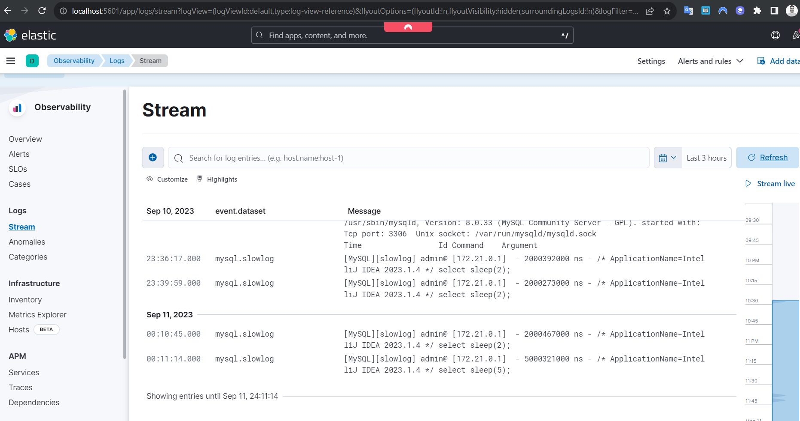

# Description
There are 2 set ups in this project
1) ELK stack: MySQL writes logs to 'mysql-slow.log' file. Filebeat process this file and sends it to ElasticSearch. Logs can be viewed in Kibana in Observability -> Logs -> Stream. Filebeat conveniently configures Kibana for us.
2) GrayLog stack: MySQL writes logs to 'mysql-slow.log' file. Filebeat process this file and sends it to Graylog. To configure Graylog go to System -> Inputs, select Beats, fill details.

# Testing
1) Open SQL console, and send any slow query, for example 'SELECT sleep(3)'
2) Depending on which docker-compose file you run, you can read logs in Kibana or Graylog

Log example in Kibana:
